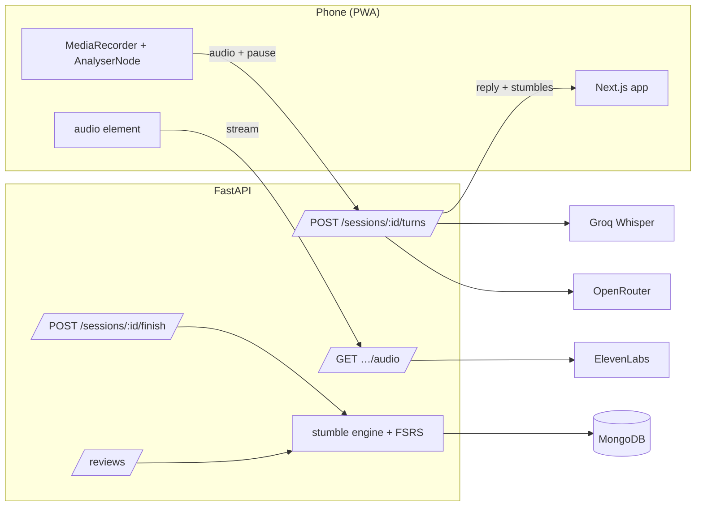

# Stumble

**Speak French. The words you can't find become the words you review.**

Stumble is a speaking-first language app. You talk your way through real scenes (a café, a pharmacy, an apartment viewing) with a character who answers out loud. Every moment you freeze, fall back to English, or get corrected is caught *in the sentence where it happened* and becomes a spaced-repetition card. The next scene is told which words are due and steers you into using them. Progress is your deck shrinking, not a streak.

Built for the [Nerdy AI Hackathon](https://hackathon.nerdy.com/), Prompt 02 (language learning). Mobile-first web app, installable as a PWA; on a wide screen it renders in a phone frame with a QR code to open it on yours.

## The loop

1. **Review** (~90 s): only the cards that are due, each shown as a cloze in your own sentence. You say the word; FSRS reschedules it.
2. **Scene** (3–4 min): a voice conversation with a goal. The character has been told your due words.
3. **Stumble capture**: freezes, code-switches, corrections and misses are detected on every turn and never interrupt you. The character just recasts.
4. **Debrief** (60 s): goal reached or not, what got caught, one win, cards added.
5. **Escalate**: the next scene unlocks. Clean production of a due word in a scene counts as a review; mastery is clean production in two scenes.

Once a week the app writes a one-page **brief for a human tutor**: the patterns in your stumbles, your strengths, and a suggested 30-minute session built from your own error list.

## The stumble engine

A turn is one request: audio (or text) plus `clientPauseMs`, the longest silence the browser measured while the mic was held. The server transcribes, then makes a single LLM call that returns the character's next line, an English translation, goal progress, and a list of stumbles, each typed as `freeze`, `code_switch`, `correction` or `miss`, with what was said, the target, the learner's sentence with the slot blanked (`Je voudrais un ___ au lait.`), the prompt line it answered, and a confidence. The reply streams back as speech while the stumbles are logged.

On finish, stumbles become cards keyed per learner by an accent-insensitive target, so stumbling on *café* twice is a lapse on one card, not two cards. A card is born FSRS-new, due in a day (two for a correction); its first real review carries the full interval spread. Cards are reviewed in sessions, not minutes: no learning steps, a daily cap of twelve, and a due window so "tomorrow" means the next session.

## Architecture



| Layer | Choice |
|---|---|
| Frontend | Next.js (App Router), React 19, TypeScript strict, Tailwind v4, RTK Query, Lucide |
| Backend | FastAPI, Pydantic v2, motor, `py-fsrs`, httpx, structlog |
| Data | MongoDB |
| Speech to text | Groq `whisper-large-v3`, prompted with mixed French/English so a fall-back to English is transcribed, not translated |
| LLM | OpenRouter (model id in env) |
| Text to speech | ElevenLabs Flash v2.5, streamed and cached |
| Hosting | AWS Amplify (frontend), AWS App Runner (backend) |

No accounts: a device id minted in the browser is the identity.

## Run it locally

Prerequisites: Node ≥ 20 with pnpm, Python ≥ 3.12 with [uv](https://docs.astral.sh/uv/), a MongoDB (local or Atlas).

```bash
# backend
cd backend
cp .env.example .env            # add MONGODB_URI and, when you have them, the API keys
uv sync
uv run uvicorn app.main:app --port 8000 --reload

# frontend
cd frontend
cp .env.example .env.local      # NEXT_PUBLIC_API_BASE_URL=http://localhost:8000
pnpm install
pnpm dev -p 3001
```

The backend refuses to start with a missing key. There are no silent fallbacks: if a provider is down mid-session the API answers 503 naming it, the scene shows it, and `GET /ready` says which providers the process is running on. `PROVIDERS=fake` is an explicit offline mode with canned replies, for tests and for working without keys on purpose; it is reported by `/ready` and flagged in the app.

Handy scripts, dev only:

```bash
cd backend
uv run python scripts/seed_demo.py         # a five-day profile; open the app with ?device=demo-maya
uv run python scripts/make_due.py          # pull every unmastered card into "due now"
```

## Tests and checks

```bash
cd backend  && uv run ruff check . && uv run ruff format --check . && uv run mypy app && uv run pytest
cd frontend && pnpm lint && pnpm typecheck && pnpm build
```

The backend suite runs offline against a mock Mongo and the fake providers; every DTO has a test asserting its camelCase wire keys.

## Repo

```
frontend/   Next.js app
backend/    FastAPI app, tests, scripts
docs/       product brief, design directions, the build plan and its daily log
```

Built in a week for the hackathon, pairing with Claude Code; the working docs in `docs/` are the actual planning artifacts, kept as they were.
